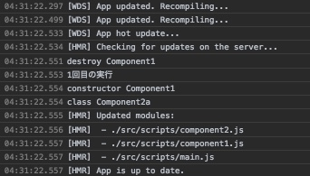
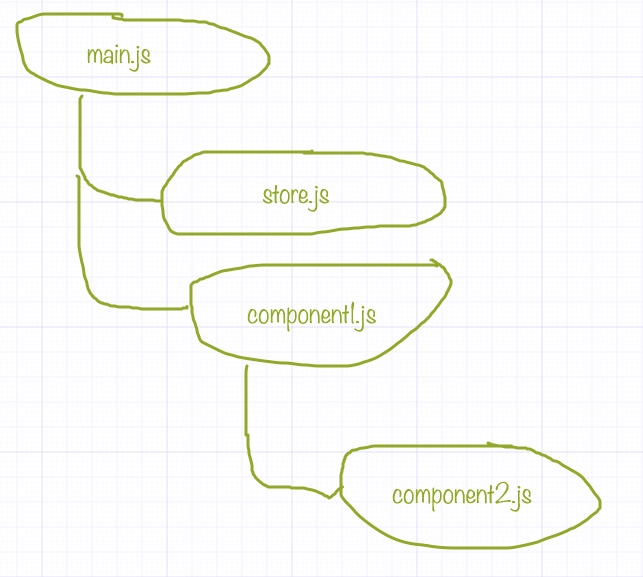

# Hot Module Placement

## HMRについて

ソースコードを書き換えたときにページのリロードなしで、書き換えたモジュールだけを差し替えてくれるWebpackの機能。

## HMRの仕組み

webpackがbundleにHMR用のスクリプトを挿入する。このスクリプトはランタイムで実行される。WebpackサーバとWebSoccketでつながっていて、モジュールに変更があったら通知を受け取る。  
```javascript
  entry: {
    main: [
      'webpack-dev-server/client?http://localhost:8901',
      'webpack/hot/dev-server',
      './src/scripts/main.js'
    ]
  }
```


## サンプル

giturl



### ファイル詳細

#### main.js

エントリー。以下を定義
- `module.hot.accept('./store.js', storeAcceptCallback)`
- `module.hot.accept()`
- `module.hot.dispose(disposeCallback)`

#### store.js

アプリケーションデータ。hmr前後で状態を引き継ぎたい

#### component1.js

main.jsで読み込んでるモジュール

#### component2.js

component1.jsで読み込んでるモジュール

### 挙動

#### main.jsを書き換えた場合

1. main.jsに`module.hot.accept()`があるので、main.jsの差し替えが決まる
(main.jsで読み込んでいるモジュールも再読込されるが、これはhmrではないので、子モジュールのdisposeとかは呼ばれない)
1. main.jsに`module.hot.dispose(disposeCallback)`があるので、`disposeCallback()`が呼ばれる
1. main.jsが差し替えられる(再実行される)

#### store.jsを書き換えた場合

1. store.jsに`module.hot.accept()`がないので、親のmain.jsがチェックされる
1. main.jsに`module.hot.accept('./store.js', storeAcceptCallback)`があるので、`storeAcceptCallback`が呼ばれる

store.jsは自動では差し替わらないので、storeAcceptCallbackの中で`require('./store')`のように読み込む必要がある
このコードがない場合は、2回目以降store.jsを書き換えてもstoreAcceptCallbackは呼ばれない

### component1.jsを書き換えた場合
1. component1.jsに`module.hot.accept()`がないので、親のmain.jsがチェックされる
1. main.jsに`module.hot.accept()`があるので、main.jsの差し替えが決まる
1. main.jsに`module.hot.dispose(disposeCallback)`があるので、`disposeCallback()`が呼ばれる
1. component1.jsに`module.hot.dispose(disposeCallback)`があるので、`disposeCallback()`が呼ばれる
1. main.jsが差し替えられる(再実行される)

### component2.jsを書き換えた場合
1. component2.jsに`module.hot.accept()`がないので、親のcomponent1.jsがチェックされる
1. component2.jsに`module.hot.accept()`がないので、親のmain.jsがチェックされる
1. main.jsに`module.hot.accept()`があるので、main.jsの差し替えが決まる
1. main.jsに`module.hot.dispose(disposeCallback)`があるので、`disposeCallback()`が呼ばれる
1. component1.jsに`module.hot.dispose(disposeCallback)`があるので、`disposeCallback()`が呼ばれる
1. main.jsが差し替えられる(再実行される)

## API

https://webpack.js.org/api/hot-module-replacement/

### module.hot.accept()

自身かdependencyに変更があったときに自身を差し替える。
差し替え前にdisposeのハンドラが定義されていれば、それが先に呼ばれる。
このファイルより上には伝わらなくなる。

```javascript
if (module.hot) {
  module.hot.accept(function errorHandler() {
    console.log('エラー');
  });
}
```

### module.hot.decline()

hmrを失敗させる。(=ページリロードになる)
```javascript
if (module.hot) {
  module.hot.decline();
}
```

### module.hot.dispose()

今のコードが差し替わる前に呼ばれる。
差し替え前に削除的な処理をしたい場合は、状態を引き継ぎたい場合に利用する。
```javascript
if (module.hot) {
  module.hot.dispose(function disposeHandler(data) {
    window.removeEventListener('click', foo);
    // module.hot.data.aでアクセスできる
    data.a = 1;
  });
}
```

### module.hot.status()

今のステータスを取得する。
ステータスはidleとかcheckとかdisposeとか今の状態の文字列。

### module.hot.check()

すべてのモジュールについて更新されていないかチェックする。

### module.hot.addStatusHandler()

ステータスに変更があったときのハンドラを登録する。

### module.hot.removeStatusHandler()

ステータスに変更があったときのハンドラを解除する。


